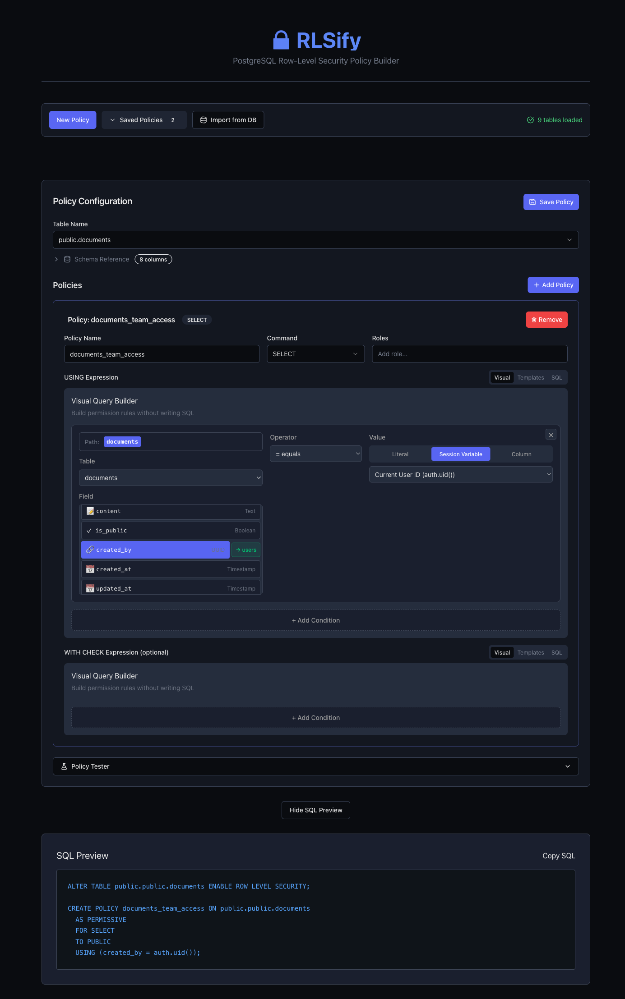

# 🔒 RLSify

**Simplify PostgreSQL Row-Level Security (RLS) policy creation with a modern TypeScript toolkit.**

RLSify is a monorepo containing tools for defining, generating, and managing PostgreSQL RLS policies through code, templates, and a visual UI.



## 📦 Packages

### Core Libraries

- **[@speajus/rlsify-types](./packages/types)** - TypeScript type definitions
- **[@speajus/rlsify-core](./packages/core)** - Core library for policy generation
- **[@speajus/rlsify-supabase](./packages/supabase)** - Supabase adapter with auth helpers

### UI & Tools

- **[@speajus/rlsify-ui](./packages/ui)** - Svelte-based web UI for visual policy building

### Examples

- **[@speajus/rlsify-examples](./packages/examples)** - General usage examples
- **[@speajus/rlsify-supabase-example](./packages/supabase-example)** - Supabase-specific examples

## 🚀 Quick Start

### Option 1: Docker (Recommended) 🐳

The fastest way to try RLSify with a complete working environment including PostgreSQL and sample data:

```bash
# 1. Copy environment variables
npm run docker:setup

# 2. Start PostgreSQL and UI
npm run docker:up

# 3. Open the UI
open http://localhost:5174

# 4. Run the interactive demo
npm run docker:demo
```

**What you get:**
- ✅ PostgreSQL 16 with Row-Level Security enabled
- ✅ Multi-tenant schema (organizations → teams → users)
- ✅ Sample data (3 orgs, 7 users, 4 teams)
- ✅ RLSify UI with Visual Builder, Templates, and SQL editor
- ✅ Auth helpers for testing RLS policies
- ✅ Interactive demo and test scripts

**Documentation:**
- [Getting Started Guide](./GETTING_STARTED_DOCKER.md) - 5-minute setup
- [Complete Docker Guide](./DOCKER.md) - Detailed documentation
- [NPM Scripts Reference](./docker/NPM_SCRIPTS.md) - All Docker commands
- [Quick Reference](./docker/QUICK_REFERENCE.md) - Common commands

### Option 2: Local Development

```bash
# Install pnpm if you haven't already
npm install -g pnpm

# Install dependencies
pnpm install

# Build all packages
pnpm build
```

### Basic Usage

```typescript
import { createContainer } from '@speajus/rlsify-core';
import type { RLSPolicyConfig } from '@speajus/rlsify-types';

const container = createContainer();
const generator = container.getPolicyGenerator();

const config: RLSPolicyConfig = {
  version: '1.0',
  table: 'posts',
  policies: [
    {
      name: 'posts_select_own',
      command: 'SELECT',
      using: 'user_id = auth.uid()',
    },
  ],
  enableRLS: true,
};

const result = await generator.generate(config);
console.log(result.statements.map(s => s.sql).join('\n'));
```

### With Supabase

```typescript
import { SupabaseAdapter } from '@speajus/rlsify-supabase';

const adapter = new SupabaseAdapter({
  supabaseUrl: process.env.SUPABASE_URL!,
  supabaseKey: process.env.SUPABASE_SERVICE_KEY!,
});

await adapter.writeMigration(config, 'add_posts_rls', './supabase/migrations');
```

## ✨ Features

- 🎯 **Type-Safe**: Full TypeScript support with comprehensive type definitions
- 🔗 **Auto-Join Detection**: Automatically resolves foreign key relationships
- 📝 **Templates**: Pre-built templates for common patterns (user-owned, role-based, multi-tenant)
- 🎨 **Visual UI**: Svelte-based web interface for building policies
- 🔄 **Migration Generation**: Create version-controlled migration files
- ✅ **Policy Simulation**: Test policies before deployment
- 🔐 **Supabase Integration**: First-class support for Supabase auth helpers
- 🏗️ **Dependency Injection**: Clean architecture with @speajus/diblob

## 🎨 Using the Visual UI

The RLSify UI provides a visual interface for building PostgreSQL Row-Level Security policies without writing SQL manually.

### Starting the UI

```bash
# Using Docker (recommended)
npm run docker:up
open http://localhost:5174

# Or for local development
cd packages/ui && pnpm dev
```

### Quick Start: Create Your First Policy

| Step | Action |
|------|--------|
| 1 | Select a table from the dropdown (e.g., `public.documents`) |
| 2 | Click **"+ Add Policy"** |
| 3 | Choose command type (SELECT, INSERT, UPDATE, DELETE) |
| 4 | Name your policy (e.g., `documents_owner_access`) |
| 5 | Click **"+ Add Condition"** in the USING Expression |
| 6 | Select field → operator → value type → value |
| 7 | Click **"Show SQL Preview"** to review |
| 8 | Click **"Save Policy"** |

### Example: User-Owned Documents Policy

To create a policy where users can only see their own documents:

1. Select `public.documents` table
2. Add a policy named `documents_owner_access` with type `SELECT`
3. Add condition: `created_by` = Session Variable `auth.uid()`
4. The generated SQL will be:
   ```sql
   CREATE POLICY documents_owner_access ON public.documents
   FOR SELECT TO authenticated
   USING (created_by = auth.uid());
   ```

### 📖 Visual Step-by-Step Guide

For a complete walkthrough with screenshots, see the **[Visual Step-by-Step Guide](./docs/guide/visual-step-by-step.md)**.

### Testing Policies

Use the **Policy Tester** section to simulate queries as different users and verify your policies work correctly before deploying.

## 📚 Documentation

See individual package READMEs for detailed documentation:

- [Core Library](./packages/core/README.md)
- [Supabase Adapter](./packages/supabase/README.md)
- [UI](./packages/ui/README.md)
- [Examples](./packages/examples/README.md)

## 🏗️ Architecture

See [Architecture Decision Record](./docs/adr/001-project-architecture.md) for detailed architectural decisions.

## 🛠️ Development

```bash
# Install dependencies
pnpm install

# Build all packages
pnpm build

# Run in development mode
pnpm dev

# Run tests
pnpm test

# Type check
pnpm typecheck

# Run examples
cd packages/examples
pnpm basic
pnpm templates
pnpm joins
```

## 📄 License

MIT © Justin Spears

