# Visual Step-by-Step Guide

This guide walks you through creating a Row-Level Security policy using the RLSify Visual UI. We'll create a policy that allows users to only see documents they created.

## Prerequisites

- RLSify UI running (see [Getting Started](./getting-started.md))
- Database with tables set up

## Step 1: Start the UI

Start the RLSify UI using Docker:

```bash
npm run docker:up
open http://localhost:5174
```

You'll see the main Policy Configuration interface:

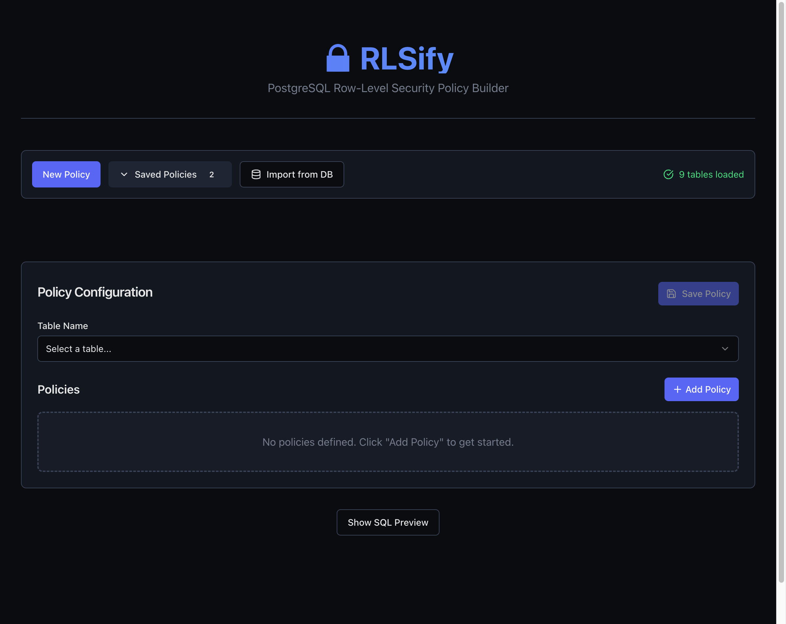

## Step 2: Select a Table

Use the **Table** dropdown to select the table you want to secure. For this example, select `public.documents`.

The Schema Reference panel on the right shows all available columns with their types:

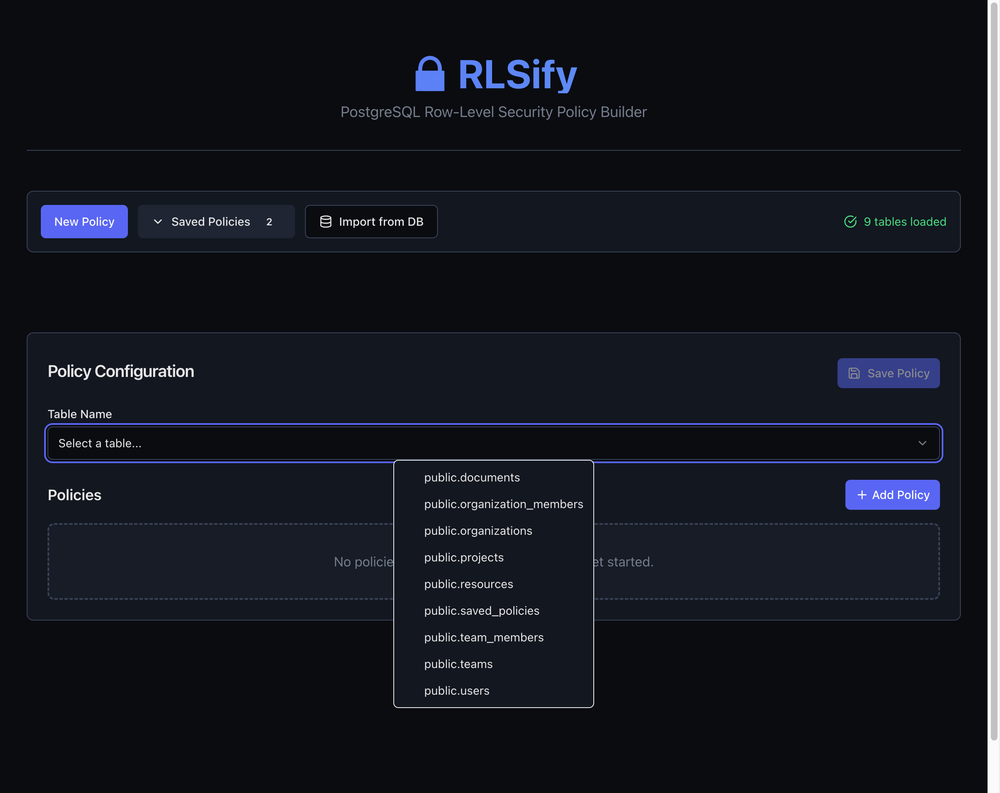

::: tip
The schema reference helps you understand what columns are available for building conditions.
:::

## Step 3: Add a New Policy

Click the **"+ Add Policy"** button to create a new policy. This adds a new policy section to the configuration:

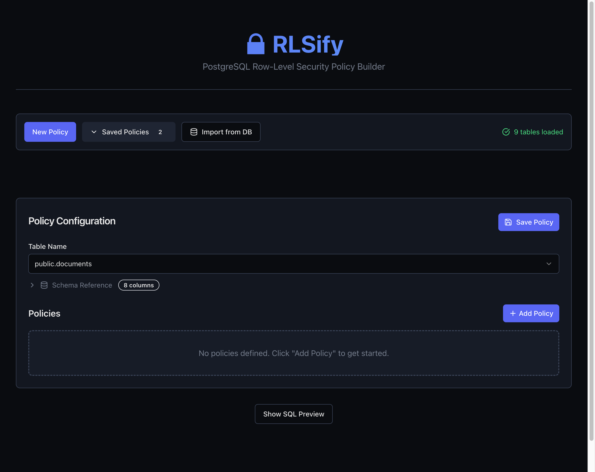

## Step 4: Configure Policy Form

After clicking Add Policy, you'll see the policy configuration form with fields for name, command type, and conditions:

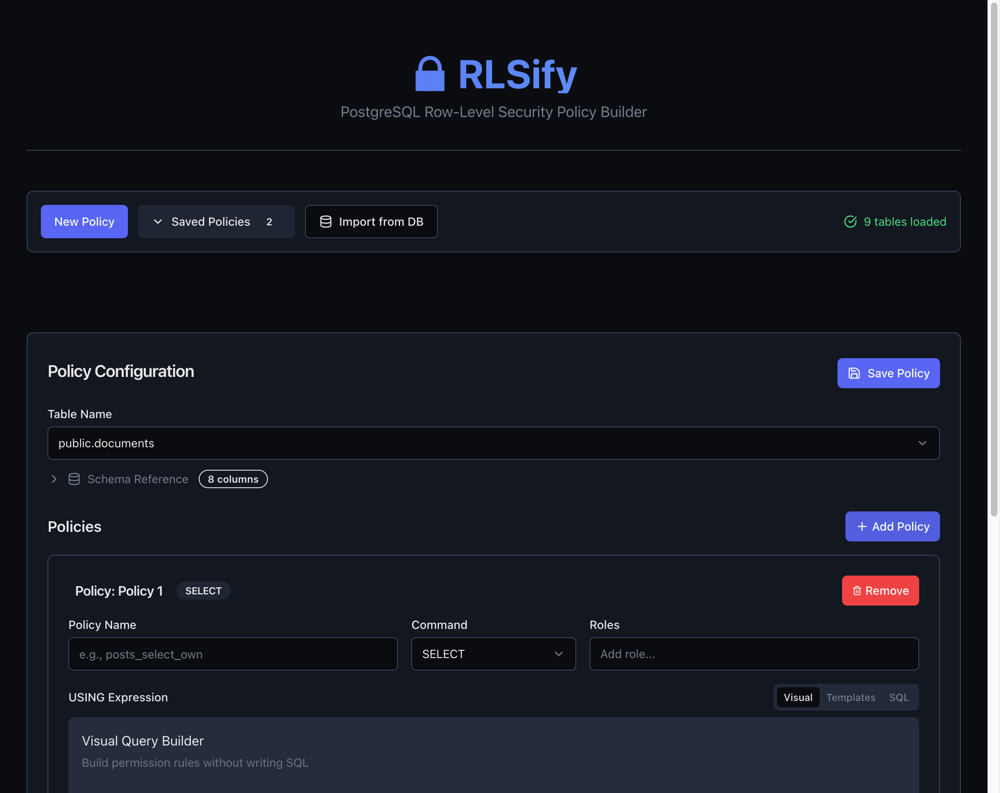

## Step 5: Name Your Policy

Enter a descriptive name for your policy. Good naming conventions include:

- `{table}_{action}_{scope}` - e.g., `documents_select_owner`
- `{table}_{role}_{permission}` - e.g., `documents_user_read`

Enter `documents_select_own`:

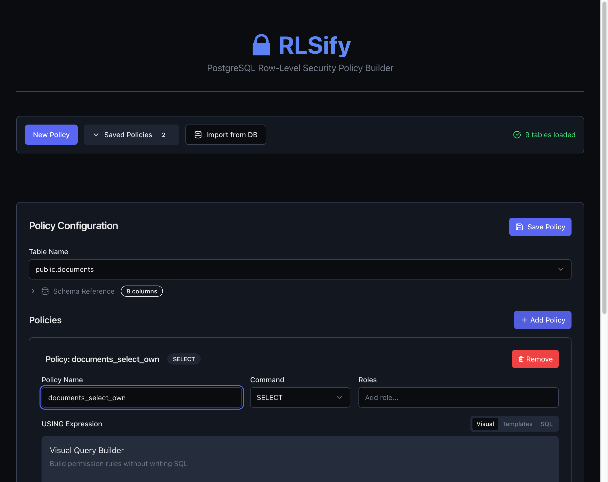

## Step 6: Add a Condition

In the **USING Expression** section, click **"+ Add Condition"** to add a rule:

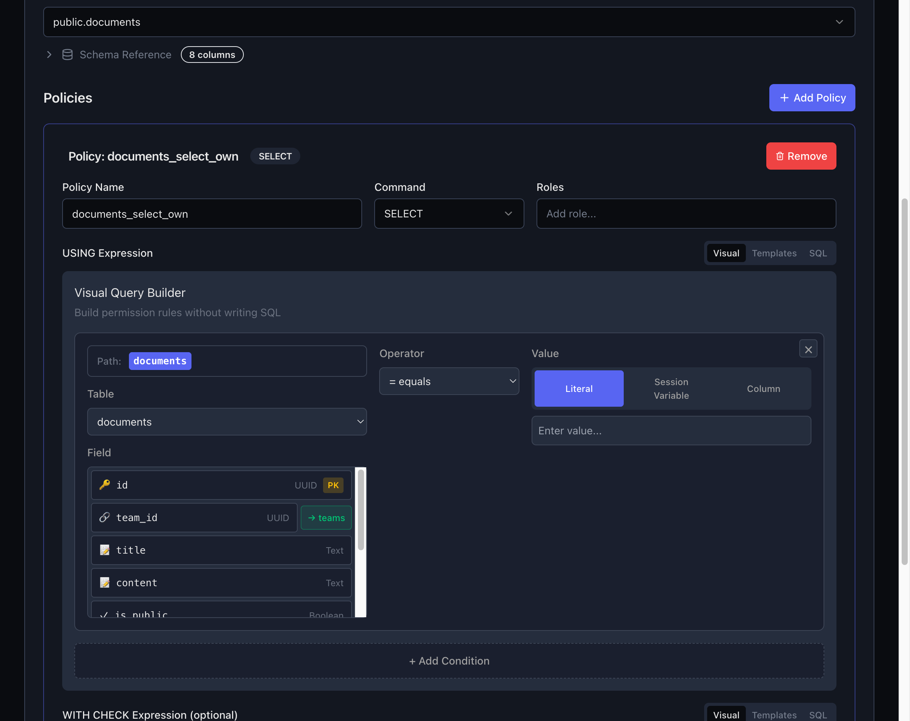

## Step 7: Select the Field

Click the **field dropdown** and select `created_by` - this is the column that stores who created each document:

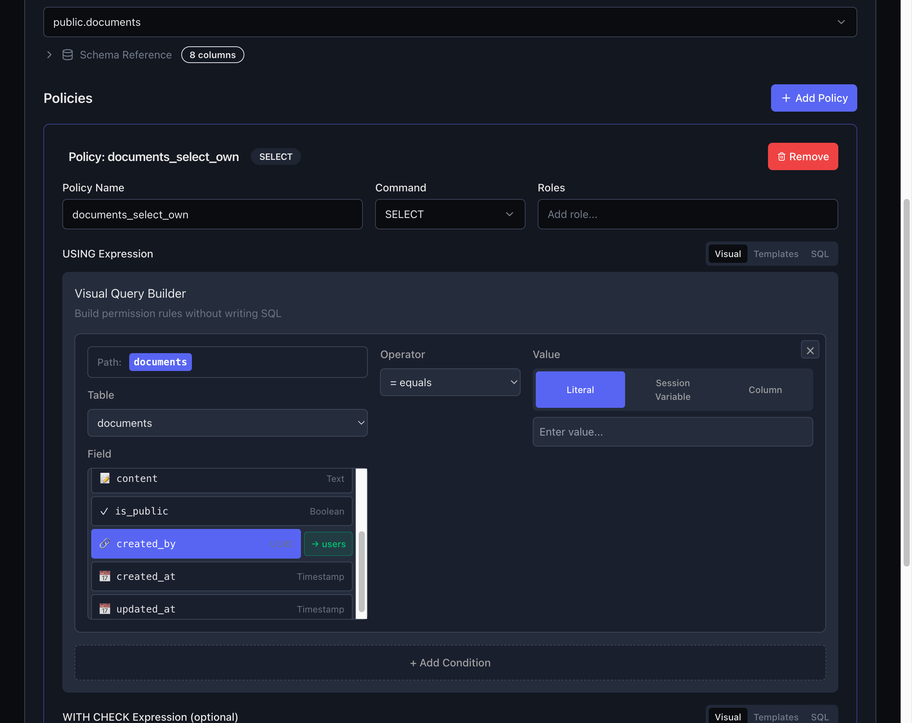

## Step 8: Choose Value Type

Click the **value type selector** and choose **"Session Variable"**. This allows us to reference the current user's ID:

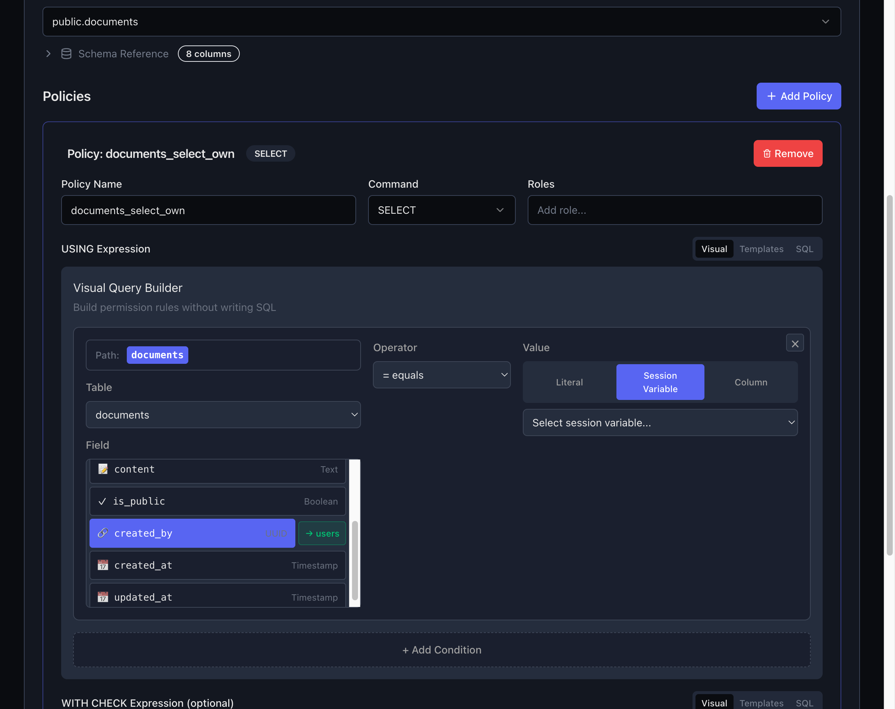

::: info Available Operators
- `=` equals
- `≠` not equals
- `>`, `>=`, `<`, `<=` comparisons
- `∈` in list
- `∉` not in list
- `~` like (pattern)
- `∅` is null
:::

## Step 9: Select the Session Variable

From the session variable dropdown, select **"Current User ID (auth.uid())"**:


::: tip Common Session Variables
- `auth.uid()` - Current user's ID (Supabase)
- `current_user` - Database username
- JWT claims for roles, org_id, email, etc.
:::

## Step 10: Preview the SQL

The **SQL Preview** section shows the generated PostgreSQL policy:

```sql
CREATE POLICY documents_select_own ON public.documents
FOR SELECT TO authenticated
USING (created_by = auth.uid());
```

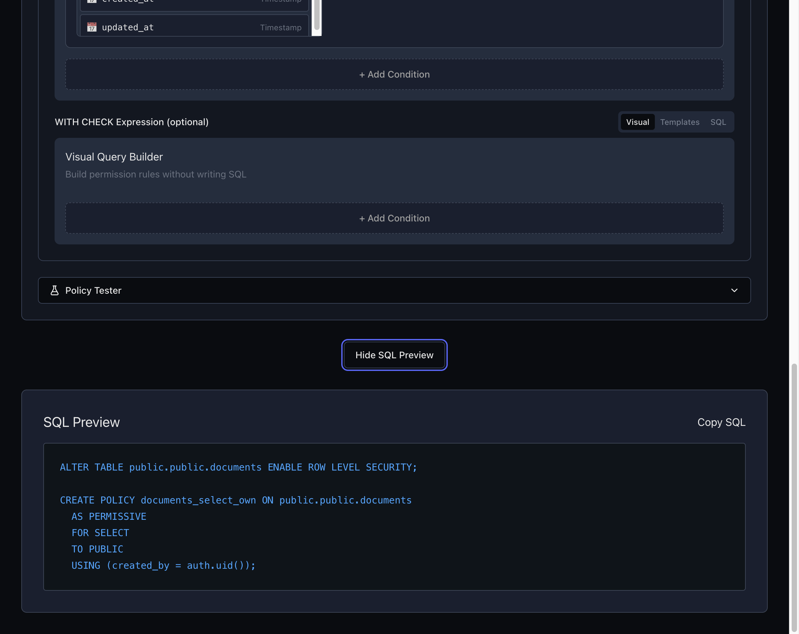

## Step 11: Test the Policy (Optional)

Expand the **Policy Tester** section to test your policy with sample data:

1. Set session context variables
2. Click "Run Test Query"
3. View which rows would be returned

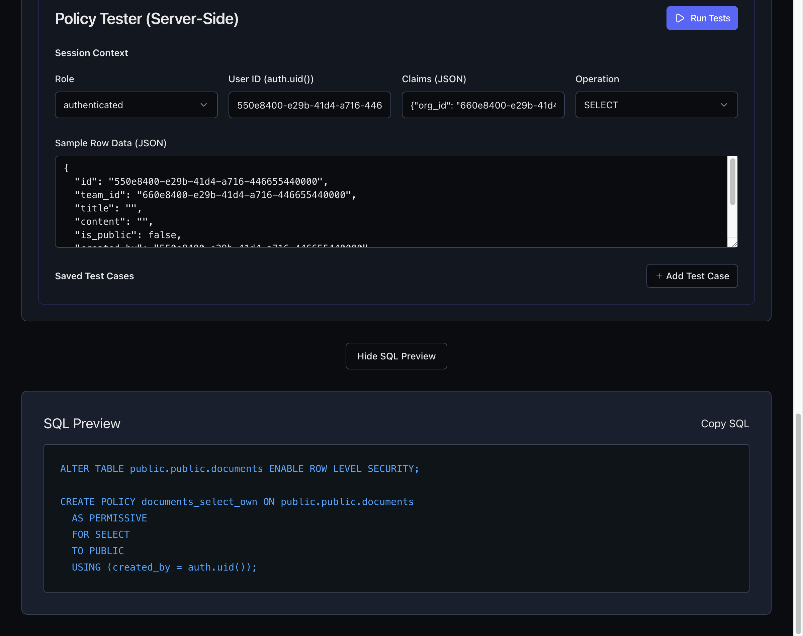

## Step 12: Save the Policy

Click the **"Save Policy"** button to save your configuration. The button will change to "Update Policy" after saving:

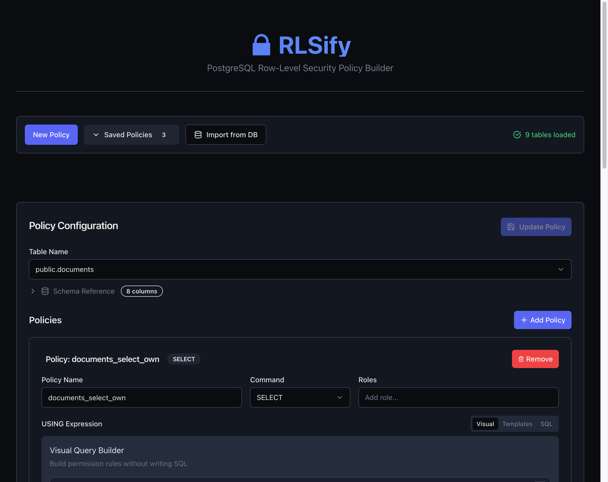

## Step 13: View Saved Policies

Click the **"Saved Policies"** dropdown to see all your saved policies. You can load, edit, or delete policies from here:

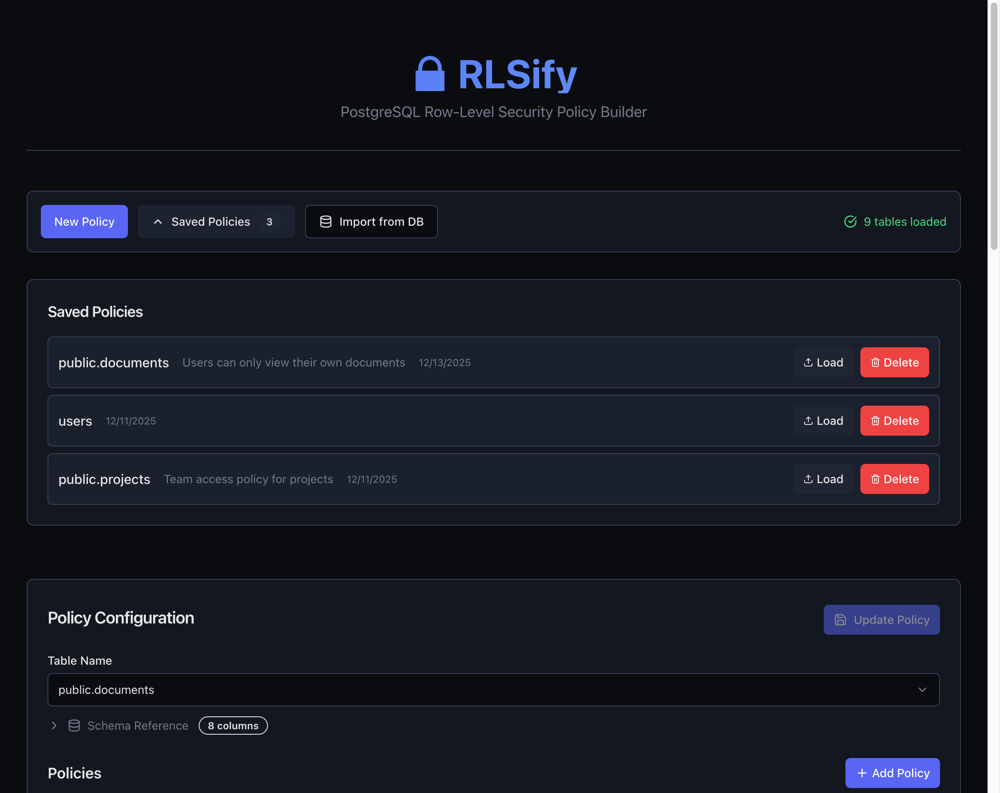

## Next Steps

- [Add multiple conditions](./expression-language.md) using AND/OR logic
- [Create policies for different commands](./policy-types.md) (INSERT, UPDATE, DELETE)
- [Test your policies](./testing-policies.md) with realistic data
- [Learn security best practices](./security-best-practices.md)

## Quick Reference

| Step | Action |
|------|--------|
| 1 | Start the UI |
| 2 | Select table |
| 3 | Add policy |
| 4 | Choose command (SELECT/INSERT/UPDATE/DELETE) |
| 5 | Name the policy |
| 6-10 | Add and configure conditions |
| 11 | Preview SQL |
| 12 | Test the policy |
| 13 | Save |

